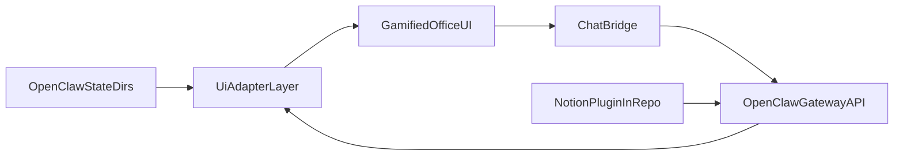

# Shell Company Architecture

## Canonical Indexes

- OpenClaw Multi-Agent Routing: https://docs.openclaw.ai/concepts/multi-agent#multi-agent-routing
- OpenClaw Plugins: https://docs.openclaw.ai/tools/plugin#plugins

## Direction

Shell Company is a UI-first control center over OpenClaw.

- OpenClaw owns runtime, bindings, sessions, and plugin lifecycle.
- Shell Company owns gamified visualization, operator workflows, and state mapping UX.
- Notion integration is delivered as an OpenClaw plugin inside this repository.

## System Overview

## Data Sources

- `~/.openclaw/openclaw.json`
- `~/.openclaw/agents/<agentId>/sessions/sessions.json`
- `~/.openclaw/agents/<agentId>/sessions/*.jsonl`
- OpenClaw gateway APIs for session operations and message send/steer flows

## UI Adapter Contracts

- Agent roster model (`AgentCardModel`)
- Session list model (`SessionRowModel`)
- Timeline model (`SessionTimelineModel`)
- Memory and skills models for multi-agent operational visibility

## Product Boundaries

### OpenClaw responsibilities

- Multi-agent routing and bindings
- Session persistence
- Tool and sandbox policy enforcement
- Plugin discovery/loading

### Shell Company responsibilities

- Agent/session visualization and gamified office interactions
- Operator memory and skills dashboards
- Chat bridge UI to selected OpenClaw sessions
- Notion plugin development and packaging in-repo
