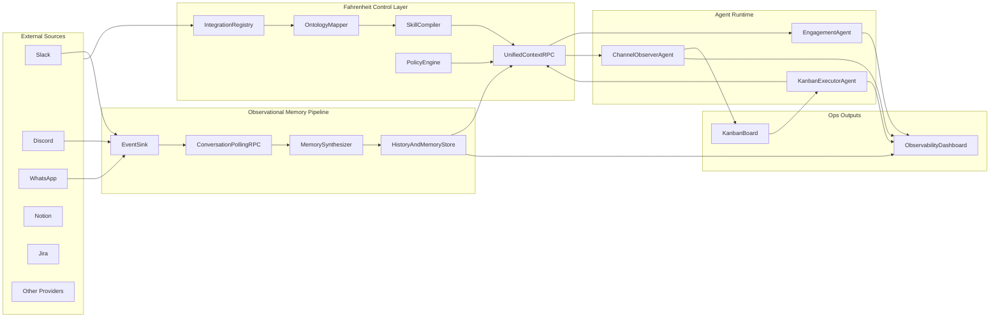

# Fahrenheit Architecture

## Purpose

Define a clear system architecture for Fahrenheit so the team can build an AI-native company operations layer without collapsing into a generic automation clone.

## Product Positioning

Fahrenheit is not just a connector engine. It is a control layer that sits above connectors:

- Connect apps and credentials safely.
- Define company ontology per app in plain text.
- Compile those definitions into executable skills/contracts.
- Expose one unified RPC for agent context/action.
- Run a separate observational memory pipeline for synthesis and planning.

## Architecture Overview

## Core Components

### 1) Integration Registry

Stores per-integration configuration:

- Provider type (Notion, Jira, Slack, Discord, etc.)
- Credentials/API key reference
- Scope and permissions
- Operational mode and policy profile

### 2) Ontology Mapper (Text-Defined)

Users describe ontology and access rules in plain language, for example:

- `Projects`: "Use Notion database Product Roadmap, status from Stage, owner from PM."
- `Tasks`: "Use Engineering Tasks view, only Active and Blocked."

The mapper converts this to a structured mapping artifact:

- Entity-to-provider binding
- Field mappings
- Fetch/update instructions
- Confidence score + clarification prompts

### 3) Skill Compiler

Compiles mapping artifacts into callable contracts/skills.  
This ensures agents call stable business operations instead of ad-hoc provider APIs.

### 4) Unified Context RPC

Single interface for runtime access:

- `context.fetch` (cross-source retrieval by ontology type)
- `context.search` (semantic/keyword over synced context)
- `context.update` (write with policy + confidence gates)
- `memory.read` (durable historical context)

Provider-specific access happens behind the RPC boundary.

### 5) Dual Pipelines (Critical Separation)

#### A) Engagement Pipeline (Real-time)

- Triggered by user interactions (DMs, mentions, allowed channels).
- Engagement agent uses unified RPC to fetch context and respond.
- Optimized for latency and interaction quality.

#### B) Observational Memory Pipeline (Asynchronous)

- Triggered by cron/poll jobs and sink processing.
- Polls conversations/events via polling RPC over event sink.
- Synthesizes durable memory and operational insights.
- Optimized for depth, pattern detection, and planning.

This separation prevents real-time channel spam requirements from blocking memory quality.

### 6) Specialized Runtime Agents

- **Engagement Agent**: user-facing replies and immediate actions.
- **Channel Observer Agent**: extracts tasks/risk/action-items from broader traffic and emits structured work.
- **Kanban Executor Agent**: reads prioritized board items, proposes or executes autonomous work loops.

### 7) Policy and Security Layer

Applied to all RPC calls and agent actions:

- Auth and source trust labeling
- Read vs write policy checks
- Confidence and approval gates
- Outbound network and tool restrictions
- Full audit logging with correlation IDs

## Channel Ingestion Model (Recommended)

Support separate policies for engagement and observation:

- `engageMode`: `dm_only | mentions | allowlist`
- `observeMode`: `none | mentions | allowlist | sampled | full`
- `allowedChannelIds`: explicit channel allowlist

Default recommendation:

- Slack/Discord: engage on DM + mentions; observe via allowlist/sampled.
- WhatsApp groups: mention-only engage by default; optional observe allowlist.

## What Overlaps with OpenClaw vs What Is Additional

### Overlap (shared baseline capabilities)

- Gateway/event ingestion
- Persistent agent runtime
- Tool invocation
- Scheduler/cron
- Logging sink

### Fahrenheit additions (primary moat)

- Text-defined ontology mapping and skill compilation
- Unified cross-source context RPC over canonical entities
- Separate observational memory pipeline and synthesis
- Multi-agent operational loop (engage, observe, execute)
- Strong policy-driven write safety and observability

## OpenClaw Compatibility Profile (Lean)

Mirrored standards:

- Binding-driven routing (`bindings[]`) and agent-namespaced session keys.
- Session scope controls for DM/group routing behavior.
- Gateway secure defaults (loopback-first, non-loopback requires auth).
- Sensitive value redaction in logs.
- Idempotent ingestion and state-versioned gateway responses.
- Persistent cron job definitions plus run history.

Explicitly deferred to stay lean:

- Native mobile/desktop app stacks.
- Large plugin marketplace/runtime expansion.
- Full browser/canvas/node-host feature families.
- Network discovery and desktop daemon lifecycle complexity.

## End-to-End Flow

1. User connects providers and supplies API keys.
2. User defines ontology availability and access instructions in text.
3. Mapper builds mapping artifact; compiler emits skills/contracts.
4. Engagement agent handles real-time interactions via unified RPC.
5. Event sink + polling RPC feeds asynchronous memory synthesis.
6. Observer agent extracts operational work into kanban.
7. Executor agent pulls prioritized tasks, executes safely, and logs outcomes.
8. Dashboard shows what happened, why, and what changed.

## Build-First Priorities

1. Lock `engageMode` vs `observeMode` policy model in config/schema.
2. Finalize unified RPC contract and provider adapter interface.
3. Stand up channel observer -> kanban emission loop.
4. Add memory synthesis job with traceable promotion criteria.
5. Ship one observability view showing Event -> Decision -> Action -> Outcome.
