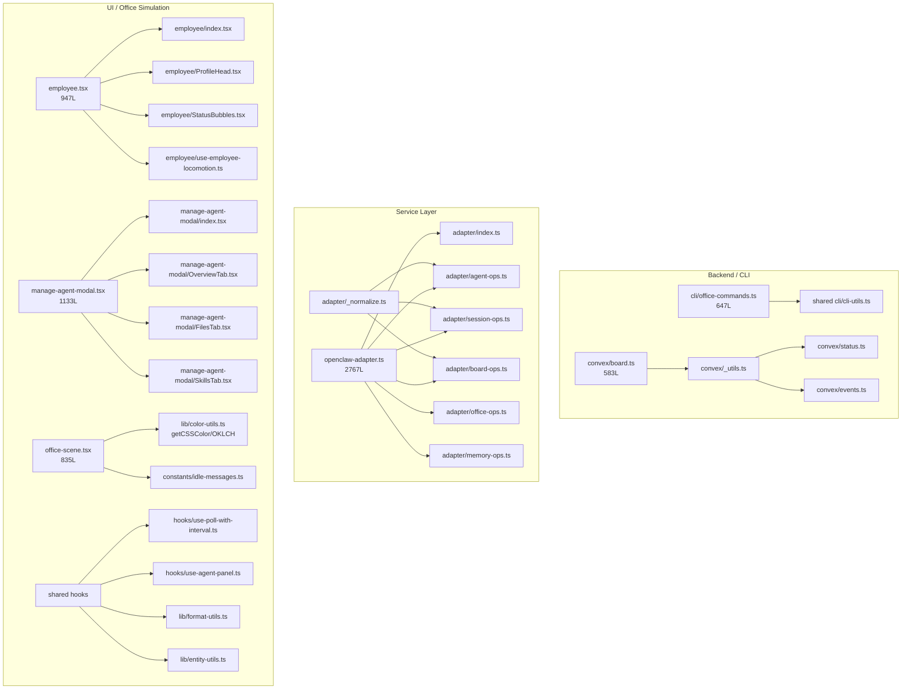

# ShellCorp Refactor Plan

## Context

- SC05/SC06/SC11 are in flight. This refactor is additive and non-breaking — no feature behavior changes.
- All large files identified via codebase scan. DRY violations catalogued across 10 patterns.
- Memory invariant MEM-0143 requires office-modal hot path stays non-blocking — preserve this throughout.

## Files Targeted (400+ lines)

- `ui/src/lib/openclaw-adapter.ts` — 2767L
- `ui/src/components/ai-elements/prompt-input.tsx` — 1392L
- `ui/src/features/office-system/components/manage-agent-modal.tsx` — 1133L
- `ui/src/features/office-system/components/employee.tsx` — 947L
- `ui/src/App.tsx` — 840L
- `ui/src/components/office-scene.tsx` — 835L
- `ui/src/lib/openclaw-types.ts` — 790L
- `ui/src/providers/office-data-provider.tsx` — 752L
- `cli/sidecar-store.ts` — 745L
- `cli/office-commands.ts` — 647L
- `ui/src/features/team-system/components/team-panel.tsx` — 609L
- `convex/board.ts` — 583L, `convex/status.ts` — 484L

## Architecture After Refactor




---

## Phase 1 — Shared Utility Extraction (Lowest Risk)

**Target DRY violations with zero behavior change.**

### 1a. `convex/_utils.ts`

Extract from `[convex/board.ts](convex/board.ts)`, `[convex/status.ts](convex/status.ts)`, `[convex/events.ts](convex/events.ts)`:

- `normalizeTeamId(value?: string)` — defined 3×, character-identical
- `trimOrUndefined(value?: string)` — defined in board.ts, reimplemented inline elsewhere
- `nowMs()` — `() => Date.now()` used as a named helper only in board.ts but replicable

### 1b. `cli/constants.ts`

- `FLOOR_SIZE = 35` and `HALF_FLOOR` — duplicated in `cli/office-commands.ts` and `cli/office-renderer.ts`

### 1c. `ui/src/lib/format-utils.ts`

- Unify `fmtTs` / `formatTimestamp` from 5 UI files into one exported `formatTimestamp(ts?: number): string`
- Files to update: `App.tsx`, `agent-session-panel.tsx`, `skills-panel.tsx`, `agent-memory-panel.tsx`, `project-artefact-panel.tsx`

### 1d. `ui/src/lib/entity-utils.ts`

- Unify `extractAgentId` / `extractAgentIdFromEmployee` — same "strip `employee-` prefix" logic in 2 files

### 1e. `openclaw-types.ts` — Unify `AgentState` type

- `"running" | "ok" | "no_work" | ...` inlined 4× → one exported `AgentState` union, re-imported everywhere

---

## Phase 2 — Hook Extraction for Office Simulation (Medium Risk, Performance Win)

**Addresses the cancellable-async pattern appearing in 12+ components.**

### 2a. `ui/src/hooks/use-poll-with-interval.ts`

Replace the `let cancelled = false` + `clearInterval` teardown repeated in 12+ files:

```typescript
// before (repeated in every panel component)
useEffect(() => {
  let cancelled = false;
  const timer = setInterval(async () => {
    if (cancelled) return;
    // ...fetch
  }, 5000);
  return () => { cancelled = true; clearInterval(timer); };
}, [deps]);

// after
const data = usePollWithInterval(fetchFn, 5000, deps);
```

Per `rerender-dependencies` rule: deps should be primitive, not object references.

### 2b. `ui/src/hooks/use-agent-panel.ts`

Consolidate shared load+cancel logic from `agent-memory-panel.tsx`, `agent-session-panel.tsx`, `manage-agent-modal.tsx`:

- Resolve `agentId` from `employeeId` (via `entity-utils`)
- Gate fetch on modal open state
- Return `{ agentId, loading, error }` — satisfies MEM-0143 (hot path stays non-blocking)

### 2c. `ui/src/hooks/use-gateway-subscription.ts`

Extract WebSocket subscription primitive shared between `use-chat-messages.ts` and `use-chat-threads.ts`.

---

## Phase 3 — Office Simulation Component Decomposition (Medium Risk)

### 3a. `[employee.tsx](ui/src/features/office-system/components/employee.tsx)` 947L → folder

```
employee/
  index.tsx          ← thin shell, composes sub-components, owns useFrame
  ProfileHead.tsx    ← image-overlay sphere head (self-contained Three.js mesh)
  StatusBubbles.tsx  ← floating heartbeat skill bubbles + thought messages
  use-employee-locomotion.ts  ← A* path requests, position interpolation, idle wander
```

- `useMemo` on voxel geometry parameters (head/body/leg colors are stable per employee)
- `useMemo` on SAMPLE_MESSAGES lookup (module-level constant, but currently triggers inline array every render)
- Extract `ProfileHead` as a standalone mesh — avoids re-rendering entire avatar on heartbeat state change

### 3b. `[office-scene.tsx](ui/src/components/office-scene.tsx)` 835L

- Extract `getCSSColor` / OKLCH→RGB converter → `ui/src/lib/color-utils.ts` (also usable in team-cluster.tsx)
- Extract `SAMPLE_MESSAGES` → `ui/src/constants/idle-messages.ts`
- `useMemo` on entity arrays: employees map, team-clusters map, office-object render list — these currently re-derive on every parent render

### 3c. `[manage-agent-modal.tsx](ui/src/features/office-system/components/manage-agent-modal.tsx)` 1133L → folder

```
manage-agent-modal/
  index.tsx       ← Dialog shell + tab switcher
  OverviewTab.tsx
  FilesTab.tsx
  ToolsTab.tsx
  SkillsTab.tsx
  ChannelsTab.tsx
  CronTab.tsx
```

### 3d. A* Grid Singleton Fix — `[a-star-pathfinding.ts](ui/src/features/nav-system/pathfinding/a-star-pathfinding.ts)`

Current module-level mutable state (`walkableGrid`, `gridWidth`, etc.) is a process-global singleton — non-reentrant and untestable in isolation. Refactor to:

```typescript
// before: module-level mutable globals
let walkableGrid: boolean[][] = [];

// after: accept grid state as parameter, expose factory
export function createPathfinder(config: GridConfig): Pathfinder { ... }
```

Low risk since only `use-employee-locomotion` (after 3a) calls it.

---

## Phase 4 — OpenClaw Adapter Split (High Impact, Moderate Risk)

`[openclaw-adapter.ts](ui/src/lib/openclaw-adapter.ts)` at 2767L is the single largest UI file. Split into domain modules, all re-exported from `adapter/index.ts` to preserve import compatibility.

```
ui/src/lib/adapter/
  index.ts          ← re-exports OpenClawAdapter class (composed from modules)
  _normalize.ts     ← normalizeOkResponse() helper — eliminates 27 repetitions
  _http.ts          ← shared fetch wrapper
  agent-ops.ts      ← agent CRUD, heartbeat, config
  session-ops.ts    ← session lifecycle, streaming
  board-ops.ts      ← kanban task mutations
  office-ops.ts     ← office object placement/position
  memory-ops.ts     ← memory entries, search
  file-ops.ts       ← agent file read/write
```

Key pattern eliminated (27 occurrences → 1):

```typescript
// before (repeated 27×)
const payload = (await response.json()) as Json;
return { ok: Boolean(payload.ok ?? true), error: ... };

// after
return normalizeOkResponse(await response.json());
```

---

## Phase 5 — `App.tsx` and `prompt-input.tsx` Cleanup

### 6a. `[App.tsx](ui/src/App.tsx)` 840L

- Already partially redundant with the HUD/panel system
- Extract `MemorySection`, `OnboardingSection` (already separate files — verify and clean)
- Apply `rendering-hoist-jsx` rule: static JSX in the tab shell should be hoisted or memoized

### 6b. `[prompt-input.tsx](ui/src/components/ai-elements/prompt-input.tsx)` 1392L → compound folder

```
ai-elements/prompt-input/
  index.tsx          ← compound root
  AttachmentBar.tsx  ← file attach + mic controls
  AgentSelect.tsx    ← agent picker dropdown
  VoiceInput.tsx     ← mic/voice recording
  SubmitBar.tsx      ← submit + abort controls
```

---

## React Best Practice Rules Applied

From the `vercel-react-best-practices` skill:

- `rerender-memo` — extract expensive 3D geometry into memoized sub-components (Phase 3a)
- `rerender-dependencies` — primitive deps in poll effects, not object references (Phase 2a)
- `rendering-hoist-jsx` — static scene elements in office-scene.tsx hoisted outside render (Phase 3b)
- `js-set-map-lookups` — agent state union lookups use Set for O(1) (Phase 1e)
- `js-cache-function-results` — getCSSColor result cacheable by CSS variable key (Phase 3b)
- `bundle-barrel-imports` — adapter split avoids one giant barrel (Phase 4)
- `rerender-functional-setstate` — chat hooks use functional setState for stable callbacks (Phase 2c)

---

## Execution Assist Matrix

- In-session skills: `vercel-react-best-practices`, `tech-impl-plan`
- Delegation: `visual-qa` after Phase 3 (office-scene and employee decomposition changes visible rendering); `code-review` before final commit
- Not needed: `explore` (already done), `prd` (refactor scope is clear)

## Debt/Optimization Insight

The A* grid singleton (Phase 3d) is the highest architectural risk beyond line counts — module-global mutable state means any future server-side rendering or multi-scene test scenario will silently corrupt pathfinding state. Fix it early while the locomotion hook is being extracted.

## Definition of Done

- All 400+ line files reduced (or folder-with-index applied)
- 10 DRY violations resolved
- TypeScript strict passes, no `any` introduced
- Tests run green (`npm run test:once` + `npm run typecheck`)
- `docs/HISTORY.md` updated with MEM-#### for new invariants
- `docs/MEMORY.md` promoted for A* singleton fix decision
- Visual QA run after Phase 3 (office simulation visual surface changed)

