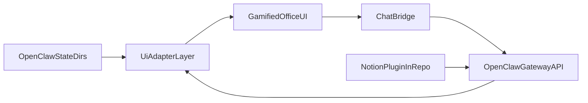
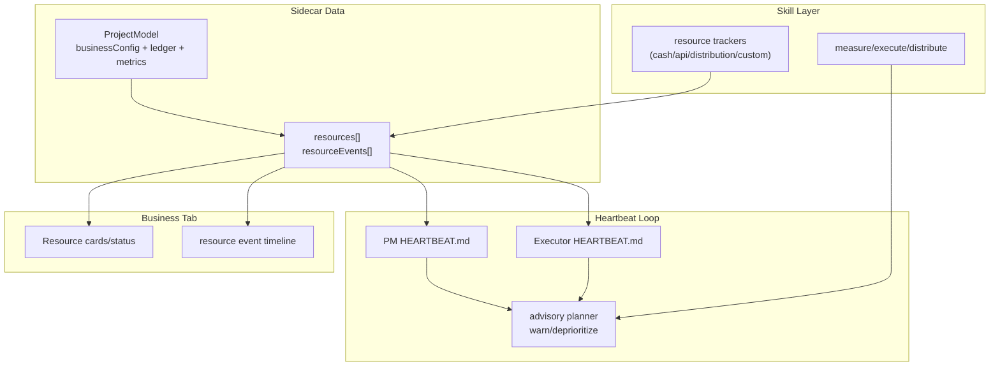

# Shell Company Architecture

## Canonical Indexes

- OpenClaw Multi-Agent Routing: https://docs.openclaw.ai/concepts/multi-agent#multi-agent-routing
- OpenClaw Plugins: https://docs.openclaw.ai/tools/plugin#plugins

## Direction

Shell Company is a UI-first control center over OpenClaw.

- OpenClaw owns runtime, bindings, sessions, and plugin lifecycle.
- Shell Company owns gamified visualization, operator workflows, and state mapping UX.
- Notion integration is delivered as an OpenClaw plugin inside this repository.

## System Overview

## Business Resource Advisory Flow

## Data Sources

- `~/.openclaw/openclaw.json`
- `~/.openclaw/company.json`
- `~/.openclaw/office.json`
- `~/.openclaw/office-objects.json`
- `~/.openclaw/agents/<agentId>/sessions/sessions.json`
- `~/.openclaw/agents/<agentId>/sessions/*.jsonl`
- OpenClaw gateway APIs for session operations and message send/steer flows

## State Ownership

ShellCorp intentionally uses a hybrid state model.

- Convex is canonical for realtime operational state:
  - agent live status
  - agent activity/event timelines
  - team board tasks
  - team board events
- Local sidecars under `~/.openclaw` are canonical for structural and configuration state:
  - `openclaw.json` for OpenClaw runtime config, bindings, plugin wiring, and agent provisioning
  - `company.json` for company/project metadata and sidecar-owned policies
  - `office.json` for room layout, decor, and camera/view settings
  - `office-objects.json` for persisted office object placement and team-cluster anchors

This split is deliberate for the current single-VPS/local-instance architecture:

- realtime value exists mainly for status and task workflows, which Convex already handles well
- office layout and object placement are warm local config, not high-frequency collaborative data
- OpenClaw itself expects file-backed runtime/config ownership, so moving `openclaw.json` into Convex would fight the runtime boundary instead of simplifying it
- office layout and object persistence carry local invariants around tile-backed room shape, cluster-anchor placement, and archive cleanup that are already encoded in sidecar-backed flows

## Why We Are Not Migrating Sidecars To Convex

We evaluated moving the broader office/config sidecars into Convex and decided not to do a full migration right now.

Reasons:

- The main realtime requirement was agent status, and that path is already in Convex.
- A full migration would create a large blast radius across onboarding, CLI sidecar store, Vite bridge endpoints, office builder persistence, team lifecycle flows, and local fallback behavior.
- `office.json` and `office-objects.json` are tightly coupled to builder invariants and local placement rules; centralizing them would add dual-write and split-brain risk unless the local sidecar path were fully removed.
- `openclaw.json` is OpenClaw-owned runtime configuration, not just app data. Replacing that file boundary with Convex would add complexity without improving operator workflows.
- The current optional-Convex setup lets the office still boot from local state even when Convex is unavailable.

If future requirements change, the first candidate for migration is selected `company.json` metadata. The least suitable candidates are `openclaw.json`, `office.json`, and `office-objects.json`.

## UI Adapter Contracts

- Agent roster model (`AgentCardModel`)
- Session list model (`SessionRowModel`)
- Timeline model (`SessionTimelineModel`)
- Memory and skills models for multi-agent operational visibility

## Product Boundaries

### OpenClaw responsibilities

- Multi-agent routing and bindings
- Session persistence
- Tool and sandbox policy enforcement
- Plugin discovery/loading

### Shell Company responsibilities

- Agent/session visualization and gamified office interactions
- Operator memory and skills dashboards
- Chat bridge UI to selected OpenClaw sessions
- Notion plugin development and packaging in-repo
