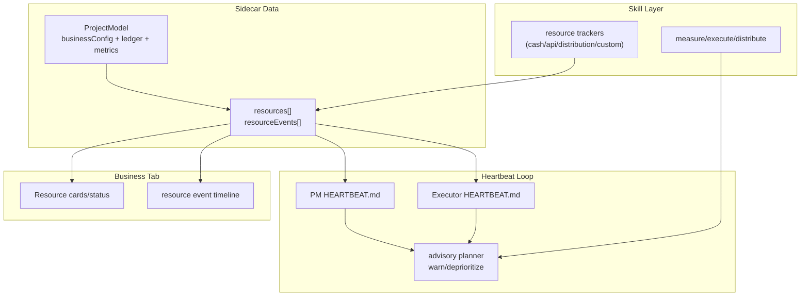

# Feature: Business Logic

This page explains the operating model behind ShellCorp team execution.

## Core Model

- Teams are represented in topology state and projected into office objects/views.
- Projects carry goals and KPIs that define success criteria.
- Agents are assigned roles and heartbeat profiles that define cadence and behavior.
- The office UI is the operator surface; OpenClaw remains runtime source of truth.

## Hard Beat Execution Loop

At each heartbeat, an agent/team loop optimizes toward project goals:

1. Pull project and Kanban context.
2. Evaluate current goal/KPI pressure.
3. Choose one action:
   - add a task
   - execute a task
   - research to unblock future execution
4. Emit auditable outcome and update next-step context.

Heartbeat governance expectations are defined in `docs/specs/SC10-spec-heartbeat-autonomy-loop.md`.

## Advisory Resource Layer

Business teams use an advisory resource envelope so PM/Executor loops can plan with finite constraints
without hard-blocking execution.

## Goals, KPIs, And Team Structure

The sidecar model captures:

- departments and projects
- team membership and role slots
- per-project goals and KPI lists
- heartbeat profiles per role/agent

Reference template:

- `templates/sidecar/company.template.json`

## Kanban Federation Semantics

ShellCorp uses canonical-provider-per-project policy:

- canonical provider (`internal`/`notion`/`vibe`) owns writes
- unified read model is shown in UI
- sync health is explicit (`healthy`, `pending`, `conflict`, `error`)

Reference:

- `docs/specs/SC06-spec-kanban-federation-sync.md`

## Ticket And Session Coupling

Planned contract direction:

- active ticket maps to active agent session
- close/reopen actions define deterministic session transitions

Reference:

- `docs/specs/SC07-spec-ticket-session-lifecycle.md`

## Observability Surfaces

- Agent memory panel (`list`, `search`, graph placeholder) backed by OpenClaw workspace memory files (`MEM-0110`).
- Team Kanban sync signals and canonical provider controls (`MEM-0115`).
- Heartbeat state and governance controls (`MEM-0114`, `SC10` planned depth).

## Related Docs

- Capability map: `docs/features-overview.md`
- CLI operations: `docs/feature-cli.md`
- Extensions and hooks: `docs/extensions.md`
