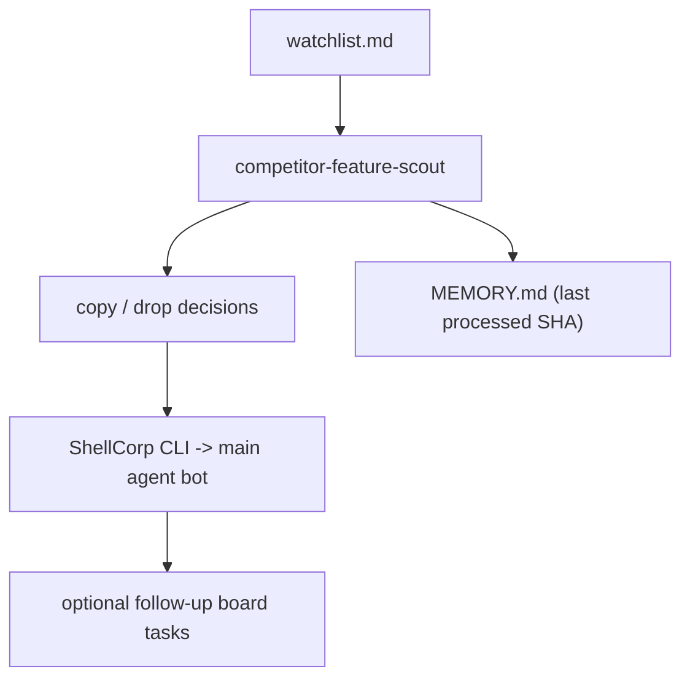

# Feature: Meta Improvement Loop

This page explains the simplified competitor-scout workflow used by ShellCorp.

## Value

- Reduce manual competitor tracking.
- Turn yesterday's commits into actionable product decisions.
- Push findings to the main agent bot through ShellCorp CLI.

## Canonical Skill Package

- `skills/competitor-feature-scout/`

Package contents:

- `SKILL.md`
- `watchlist.md`
- `MEMORY.md`

## Core Workflow

1. Read `skills/competitor-feature-scout/watchlist.md`.
2. Fetch last-day commits (or since last SHA in `MEMORY.md`).
3. Identify useful feature changes.
4. Decide `copy` or `drop` for each feature.
5. Post findings to the main agent bot via ShellCorp CLI.
6. Update `skills/competitor-feature-scout/MEMORY.md` with latest processed SHA and run notes.

## Data Flow

## Guardrails

- Keep it daily and lightweight.
- Focus on product-significant changes.
- Do not blindly copy code. Adapt ideas to ShellCorp patterns.
- Keep posts concise and operator-readable.

## Related Docs

- Feature overview: `docs/public-docs/features-overview.md`
- CEO cookbook: `docs/how-to/ceo-team-cli-scl-cookbook.md`
- Skill package: `skills/competitor-feature-scout/`
